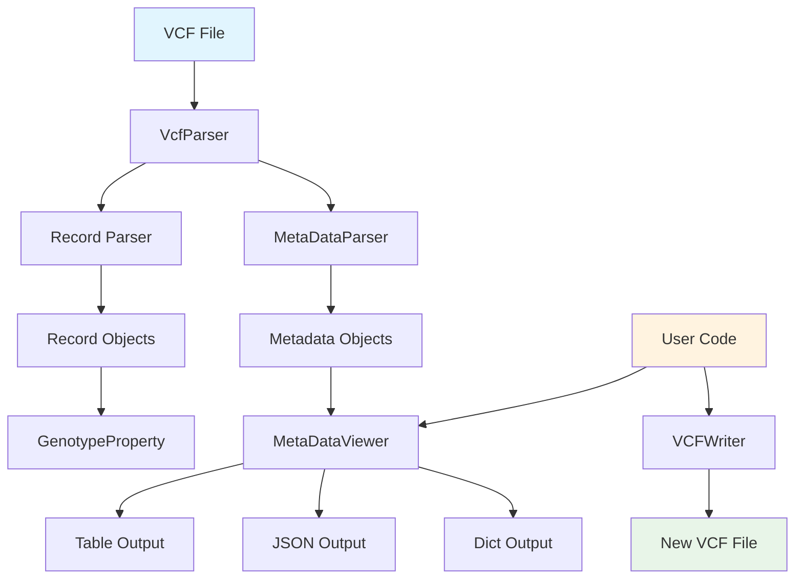
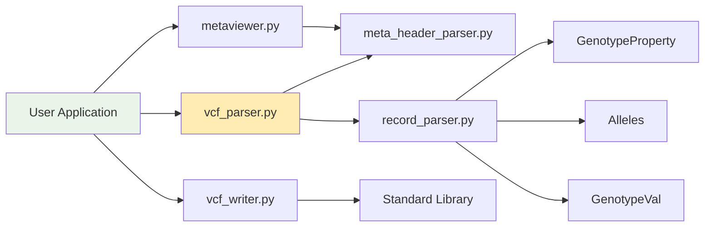

# vcfparser Architecture Documentation

## Overview

The vcfparser library provides a clean, type-safe Python API for parsing, analyzing, and writing VCF (Variant Call Format) files. The architecture follows a modular design with clear separation of concerns.

## High-Level Architecture



## Component Architecture

### 1. Core Parsing Engine

```
┌─────────────────────────────────────────────────────────────────┐
│                        VcfParser                               │
│  ┌─────────────────┐    ┌─────────────────┐                   │
│  │  parse_metadata │    │  parse_records  │                   │
│  │       │         │    │       │         │                   │
│  │       ▼         │    │       ▼         │                   │
│  │ MetaDataParser  │    │ Record Iterator │                   │
│  └─────────────────┘    └─────────────────┘                   │
└─────────────────────────────────────────────────────────────────┘
```

### 2. Metadata Processing Chain

```
VCF Header Lines
       │
       ▼
┌──────────────────┐
│  MetaDataParser  │
│                  │
│  • ##fileformat  │
│  • ##INFO        │
│  • ##FORMAT      │
│  • ##FILTER      │
│  • ##contig      │
│  • ##reference   │
│  • #CHROM line   │
└──────────────────┘
       │
       ▼
┌──────────────────┐
│ Structured Data  │
│                  │
│  • infos_: List  │
│  • format_: List │
│  • filters_: List│
│  • contig: List  │
│  • sample_names  │
└──────────────────┘
```

### 3. Record Processing Pipeline

```
VCF Data Lines
       │
       ▼
┌──────────────────┐      ┌─────────────────────┐
│     Record       │      │  GenotypeProperty   │
│                  │      │                     │
│  • CHROM, POS    │──────►  • isHOMREF()       │
│  • ID, REF, ALT  │      │  • isHETVAR()       │
│  • QUAL, FILTER  │      │  • isHOMVAR()       │
│  • INFO          │      │  • isMissing()      │
│  • FORMAT        │      │  • hasSNP()         │
│  • Sample data   │      │  • hasINDEL()       │
└──────────────────┘      └─────────────────────┘
       │
       ▼
┌──────────────────┐
│    Utilities     │
│                  │
│  • _to_iupac()   │
│  • get_info_dict │
│  • format mapping│
└──────────────────┘
```

### 4. Genotype Analysis System

```
                    GenotypeProperty
                          │
                          ▼
        ┌─────────────────────────────────────────┐
        │              Alleles                    │
        │                                         │
        │  ┌─────────────┐  ┌─────────────────────┤
        │  │ hom_ref_    │  │ GenotypeVal         │
        │  │ samples     │  │                     │
        │  ├─────────────┤  │  • gt_type         │
        │  │ hom_var_    │  │  • phased           │
        │  │ samples     │  │  • _alleles         │
        │  ├─────────────┤  │  • _ismissing       │
        │  │ het_var_    │  │                     │
        │  │ samples     │  └─────────────────────┘
        │  ├─────────────┤
        │  │ missing_    │
        │  │ samples     │
        │  ├─────────────┤
        │  │ phased_     │
        │  │ samples     │
        │  └─────────────┘
        └─────────────────────────────────────────┘
```

## Data Flow Architecture

### Input Processing Flow

```
┌───────────┐    ┌─────────────┐    ┌──────────────┐    ┌─────────────┐
│ VCF File  │───▶│ File Reader │───▶│ Line Parser  │───▶│ Object      │
│           │    │             │    │              │    │ Creation    │
│ • Header  │    │ • UTF-8     │    │ • Metadata   │    │             │
│ • Records │    │ • .gz       │    │ • Records    │    │ • Metadata  │
│           │    │ • Error     │    │ • Validation │    │ • Records   │
│           │    │   handling  │    │              │    │ • Genotypes │
└───────────┘    └─────────────┘    └──────────────┘    └─────────────┘
```

### Output Generation Flow

```
┌─────────────┐    ┌──────────────┐    ┌─────────────┐    ┌────────────┐
│ Parsed Data │───▶│ MetaDataViewer│───▶│ Formatter   │───▶│ Output     │
│             │    │               │    │             │    │ Files      │
│ • Metadata  │    │ • obj_to_dict │    │ • Table     │    │            │
│ • Records   │    │ • filtering   │    │ • JSON      │    │ • .table   │
│ • Genotypes │    │ • aggregation │    │ • OrderDict │    │ • .json    │
│             │    │               │    │             │    │ • .dict    │
└─────────────┘    └──────────────┘    └─────────────┘    └────────────┘
```

### Writing Flow

```
┌─────────────┐    ┌─────────────┐    ┌─────────────┐    ┌─────────────┐
│ Application │───▶│ VCFWriter   │───▶│ Formatter   │───▶│ VCF File    │
│ Data        │    │             │    │             │    │             │
│             │    │ • Metadata  │    │ • Header    │    │ • Valid VCF │
│ • INFO      │    │ • Records   │    │ • Records   │    │ • Spec      │
│ • FORMAT    │    │ • Headers   │    │ • Validation│    │   compliant │
│ • Samples   │    │ • Context   │    │             │    │             │
│             │    │   manager   │    │             │    │             │
└─────────────┘    └─────────────┘    └─────────────┘    └─────────────┘
```

## Module Dependencies



## Type System Architecture

The library uses comprehensive type hints for static analysis and IDE support:

```python
# Core type definitions
from typing import List, Dict, Optional, Union, Any, Iterator

class VcfParser:
    def parse_metadata(self) -> MetaDataParser: ...
    def parse_records(self) -> Iterator[Record]: ...

class Record:
    CHROM: Optional[str]
    POS: Optional[str] 
    ALT: List[str]
    sample_names: Optional[List[str]]
    mapped_format_to_sample: Dict[str, Dict[str, str]]

class MetaDataViewer:
    def __init__(self, vcf_meta_file: str, filename: str = "vcfmetafile") -> None: ...
    def save_as_json(self) -> None: ...
    def print_requested_metadata(self, metadata_of_interest: List[str]) -> None: ...
```

## Error Handling Architecture

```
┌─────────────────┐    ┌─────────────────┐    ┌─────────────────┐
│ Input Validation│───▶│ Error Detection │───▶│ Error Recovery  │
│                 │    │                 │    │                 │
│ • File exists   │    │ • Parse errors  │    │ • Graceful      │
│ • Format check  │    │ • Invalid data  │    │   degradation   │
│ • Encoding      │    │ • Missing fields│    │ • User feedback │
│                 │    │ • Type errors   │    │ • Logging       │
└─────────────────┘    └─────────────────┘    └─────────────────┘
```

## Performance Considerations

### Memory Efficiency
- **Lazy Loading**: Records are parsed on-demand via iterators
- **Minimal Copies**: Data structures reference original strings where possible  
- **Optional Processing**: Genotype analysis only when needed

### Processing Speed
- **Optimized Parsing**: Minimal string operations and splits
- **Efficient Lookups**: Dictionary-based metadata access
- **Streaming**: Large VCF files processed without loading entire file

### Cython Optimization Points
```
High-Impact Areas for Cythonization:
┌─────────────────────────────────────┐
│ 1. MetaDataParser.parse_lines()     │ ← Regex-heavy parsing
│ 2. Record.__init__()                │ ← Called for every record
│ 3. GenotypeProperty methods         │ ← Hot loops over samples
│ 4. String splitting/joining         │ ← Core parsing operations
└─────────────────────────────────────┘
```

## Usage Patterns

### Common Workflow 1: Basic Parsing
```python
from vcfparser import VcfParser

# Parse VCF file
vcf = VcfParser("example.vcf")
metadata = vcf.parse_metadata()
records = vcf.parse_records()

# Analyze first record
record = next(records)
genotype_info = record.genotype_property
homref_samples = genotype_info.isHOMREF()
```

### Common Workflow 2: Metadata Export
```python
from vcfparser.metaviewer import MetaDataViewer

# Create viewer and export metadata
viewer = MetaDataViewer("example.vcf", "output_base")
viewer.save_as_json()      # Creates output_base.json
viewer.save_as_table()     # Creates output_base.table
```

### Common Workflow 3: VCF Writing
```python
from vcfparser.vcf_writer import VCFWriter

# Write new VCF with context manager
with VCFWriter("output.vcf") as writer:
    writer.add_normal_metadata("fileformat", "VCFv4.3")
    writer.add_info("DP", "1", "Integer", "Total depth")
    writer.add_header_line("#CHROM\tPOS\tID\tREF\tALT\tQUAL\tFILTER\tINFO")
    writer.add_record_from_parts("chr1", 123, ".", "A", "T", "60", "PASS", "DP=20")
```

## Extension Points

The architecture supports extension through:

1. **Custom Genotype Analysis**: Extend `GenotypeProperty` class
2. **Additional Export Formats**: Add methods to `MetaDataViewer` 
3. **VCF Validation**: Extend `VCFWriter` with validation rules
4. **Performance**: Drop-in Cython replacements for hot paths

This modular design ensures maintainability while providing flexibility for future enhancements.
